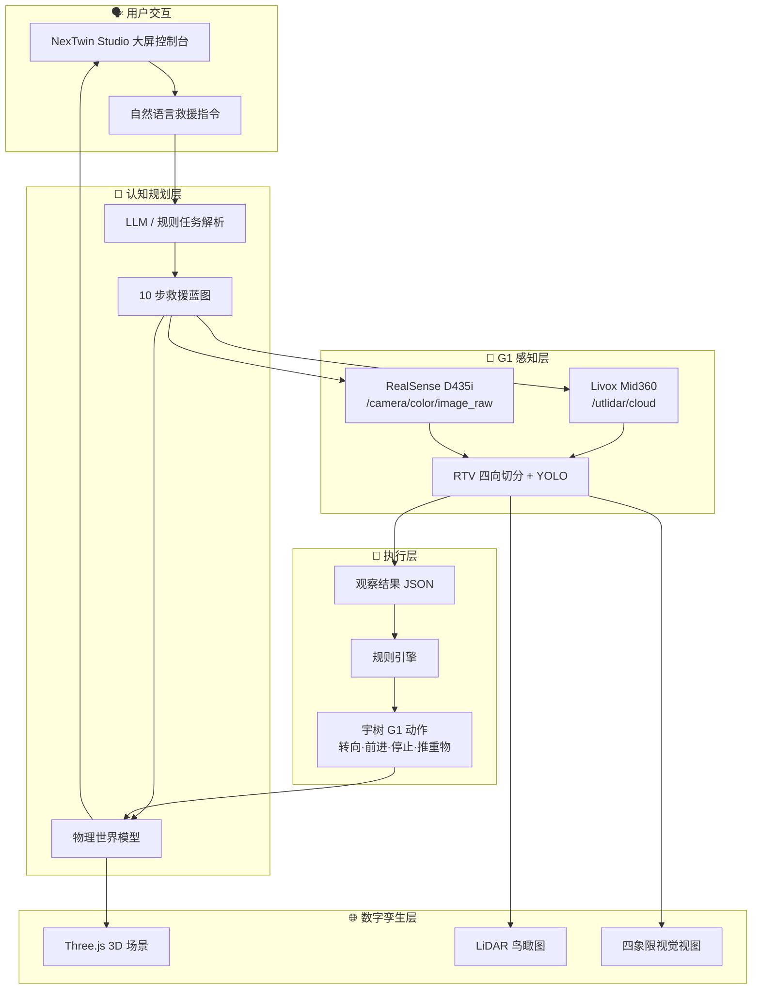

# NexTwin 星孪 — 面向人形机器人的物理世界模型与语言驱动执行系统

<div align="center">

# ⬡ Andrea-NexTwin

**让机器人看懂世界，听懂任务，并在真实空间中行动**

[](LICENSE)
[](https://python.org)
[](https://fastapi.tiangolo.com)
[](https://docs.ros.org)
[](https://threejs.org)

[Demo 视频](#-demo-视频) · [快速开始](#-快速开始) · [架构图](#️-架构图) · [API 示例](#-api-示例)

</div>

---

## 📌 项目名称

**Andrea-NexTwin（NexTwin 星孪）** — 面向人形机器人的物理世界模型与语言驱动执行系统

## 💡 一句话介绍

> **NexTwin 给机器人一个可执行的物理世界模型，让机器人看懂现场、听懂任务，并在真实空间中行动。**

## 🎬 Demo 视频

[](https://your-demo-video-url-here)

**Demo 主题：宇树 G1 无人救援 — 10 步闭环**

用户下达救援指令 → G1 启动 → Livox 雷达 + RealSense 视觉感知 → 四向切分 → YOLO 识别被压 Mini Pi → 观察 JSON → 规则引擎规划 → 机器人转向/前进/推重物 → 救援成功 → 大屏展示

## 🏗️ 架构图



**闭环：指令 → 启动 → 感知 → 切分 → 识别 → 观察 → 规划 → 执行 → 成功 → 展示**

## 🚀 快速开始

### 一键启动（Mock 模式，无需真机）

```bash
git clone https://github.com/MermaidLiu/Andrea-NexTwin.git
cd Andrea-NexTwin
chmod +x scripts/run_demo.sh
./scripts/run_demo.sh
```

浏览器打开 **http://localhost:8080**

### 手动启动

```bash
python3 -m venv .venv && source .venv/bin/activate
pip install -r requirements.txt
python3 -m nextwin
```

### Demo 操作流程

1. 页面加载后自动解析默认救援任务蓝图（10 步）
2. 点击 **「▶ 执行 Demo」** 启动完整救援闭环
3. 观察大屏：10 步时间线、LiDAR BEV、D435i 相机、四象限视图、观察 JSON、规则引擎动作
4. 3D 数字孪生中 G1 移动、推重物、解救 Mini Pi

### 接入宇树 G1 真机（ROS2）

```bash
# 1. 安装 unitree_ros2（Ubuntu，参考 scripts/setup_g1_ros2.sh）
source ~/unitree_ros2/setup.sh

# 2. 配置环境变量（可复制 .env.g1.example）
export UNITREE_ROBOT_MODEL=g1
export UNITREE_SENSOR_MODE=ros2
export UNITREE_LIDAR_TOPIC=/utlidar/cloud
export UNITREE_CAMERA_TOPIC=/camera/color/image_raw

# 3. 启动 NexTwin
python3 -m nextwin
```

| 传感器 | 话题 | 说明 |
|--------|------|------|
| Livox Mid360 | `/utlidar/cloud` | 点云 → BEV + 四向视图 |
| RealSense D435i | `/camera/color/image_raw` | RGB 视觉 |
| 深度 | `/camera/depth/image_rect_raw` | 深度图（可选） |
| IMU | `/utlidar/imu` | 姿态（可选） |

### 可选：接入 LLM

```bash
export OPENAI_API_KEY="sk-..."
export OPENAI_BASE_URL="https://api.openai.com/v1"
python3 -m nextwin
```

未配置 API Key 时，系统自动使用规则解析器（Demo 完全可用）。

## 🛠️ 技术栈

| 层级 | 技术 |
|------|------|
| 后端 | Python · FastAPI · WebSocket · Pydantic |
| 前端 | HTML/CSS · Three.js · 原生 ES Modules |
| 感知 | Livox Mid360 · RealSense D435i · OpenCV · YOLOv8 |
| AI | OpenAI API / 规则解析器 / 规则引擎 |
| 3D | Three.js 数字孪生渲染 |
| 硬件 | 宇树 G1 · unitree_ros2 · unitree_sdk2_python |

## 📁 文件结构

```
Andrea-NexTwin/
├── nextwin/                        # 核心 Python 包
│   ├── server.py                   # FastAPI 服务 (REST + WebSocket)
│   ├── task_parser.py              # 自然语言 → 10 步救援蓝图
│   ├── world_model.py              # 物理世界模型状态机
│   ├── executor.py                 # RescueExecutor 救援流水线
│   ├── observation.py              # 结构化观察 JSON
│   ├── rule_engine.py              # turn → forward → stop → push
│   ├── models.py                   # RescuePhase / ActionPlan 等
│   ├── config.py                   # G1 传感器与阶段配置
│   ├── rtv/                        # RTV 感知管线
│   │   ├── pipeline.py             # 感知 → 切分 → YOLO → 观察
│   │   ├── lidar_processor.py      # 点云 → BEV + 四向视图
│   │   ├── panoramic.py            # 相机四向切分
│   │   └── detector.py             # YOLO + Mock 检测器
│   └── devices/                    # G1 硬件桥接
│       ├── unitree_bridge.py       # 统一传感器桥 (mock|ros2|sdk)
│       ├── ros2_bridge.py          # ROS2 订阅
│       ├── g1_control.py           # G1 运动控制
│       ├── g1_config.py            # G1 话题预设
│       └── mock_sensor.py          # 合成 Livox + D435i 数据
├── web/                            # NexTwin Studio 大屏前端
│   ├── index.html
│   ├── css/style.css
│   └── js/
│       ├── app.js                  # 主逻辑 + WebSocket
│       └── scene3d.js              # Three.js 3D 场景
├── configs/
│   ├── g1_sensor.yaml              # G1 传感器配置
│   └── rescue_scene.yaml           # 救援场景配置
├── scripts/
│   ├── run_demo.sh                 # 一键启动
│   └── setup_g1_ros2.sh            # G1 ROS2 环境脚本
├── .env.g1.example                 # G1 真机环境变量示例
├── requirements.txt
└── README.md
```

## 🔌 API 示例

### 提交救援指令

```bash
curl -X POST http://localhost:8080/api/v1/task \
  -H "Content-Type: application/json" \
  -d '{"instruction": "执行无人救援任务：宇树机器人启动后，通过 onboard 雷达+视觉感知找到被重物压住的 Mini Pi 并实施救援。"}'
```

**Response:**

```json
{
  "task_id": "task_a1b2c3d4",
  "blueprint": {
    "scene": "rescue_scene",
    "scene_label": "宇树 G1 无人救援",
    "scenario": "rescue",
    "target": "mini_pi",
    "steps": [
      {"phase": "issue_command", "label": "救援指令下达"},
      {"phase": "robot_start", "label": "宇树机器人启动"},
      {"phase": "unitree_sensing", "label": "雷达+视觉感知"},
      {"phase": "split_views", "label": "四向切分"},
      {"phase": "yolo_detect", "label": "YOLO 识别 Mini Pi"},
      {"phase": "observation_json", "label": "观察结果 JSON"},
      {"phase": "rule_engine", "label": "规则引擎判断"},
      {"phase": "robot_execute", "label": "转向·前进·推重物"},
      {"phase": "rescue_success", "label": "成功解救"},
      {"phase": "display_result", "label": "大屏显示结果"}
    ]
  }
}
```

### 启动救援执行

```bash
curl -X POST http://localhost:8080/api/v1/execute \
  -H "Content-Type: application/json" \
  -d '{"use_simulation": true}'
```

### WebSocket 实时推送

```
ws://localhost:8080/ws
```

事件类型: `task_created` · `phase_start` · `observation` · `action_plan` · `robot_move` · `phase_end` · `execution_end`

## 💬 Prompt 示例

**用户输入：**
```
执行无人救援任务：宇树机器人启动后，通过 onboard 雷达+视觉感知找到被重物压住的 Mini Pi 并实施救援。
```

**规则引擎输出动作序列：**
```json
{
  "actions": [
    {"type": "turn", "params": {"angle_deg": -45}, "reason": "转向坍塌区域"},
    {"type": "forward", "params": {"distance_m": 1.5}, "reason": "接近 Mini Pi"},
    {"type": "stop", "params": {}, "reason": "到达推重物位置"},
    {"type": "push", "params": {"target": "heavy_debris"}, "reason": "推开重物解救 Mini Pi"}
  ]
}
```

## 🗺️ Roadmap

| 阶段 | 目标 | 状态 |
|------|------|------|
| **Demo 1.0** | 10 步救援闭环 + Mock 感知 + 大屏展示 | ✅ 完成 |
| **Demo 2.0** | G1 真机 ROS2 感知对接 | 🟡 进行中 |
| **Demo 3.0** | G1 低层运动控制 (unitree_ros2) | ⚪ 计划中 |
| **Studio 1.0** | Hyper3D 场景自动生成 | ⚪ 计划中 |
| **Cloud** | API 平台 + 数据沉淀 | ⚪ 计划中 |

## 👥 Team

| 角色 | 负责 |
|------|------|
| @MermaidLiu | 项目负责人 · 产品定义 |
| AI / VLA | 语言任务解析 · 世界模型 · 规则引擎 |
| 机器人 | 宇树 G1 感知与控制 |
| 3D | 数字孪生 · 大屏可视化 |
| 前端 | NexTwin Studio 控制台 |

## 📄 License

[MIT License](LICENSE) · Copyright (c) 2026 Andrea-NexTwin Team
