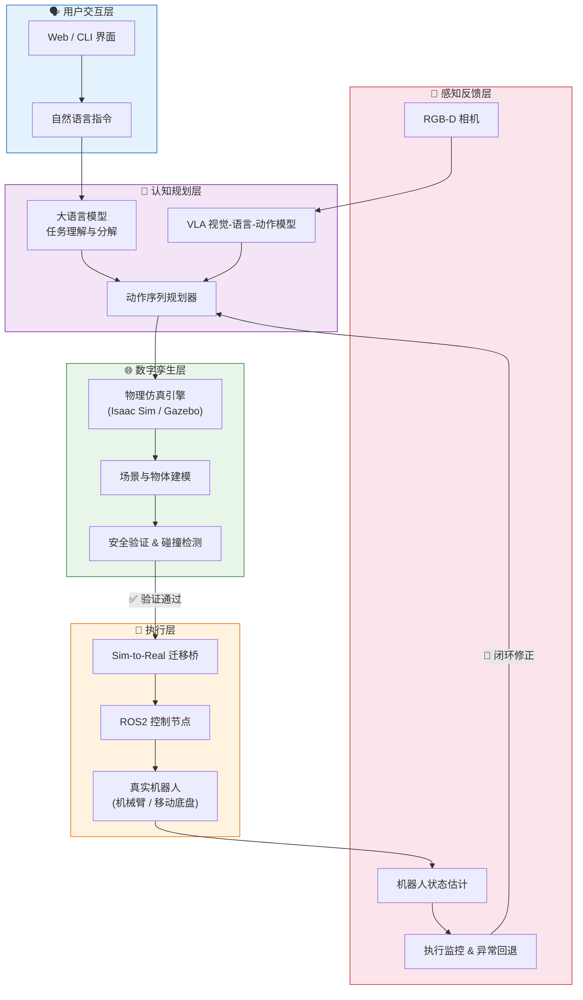
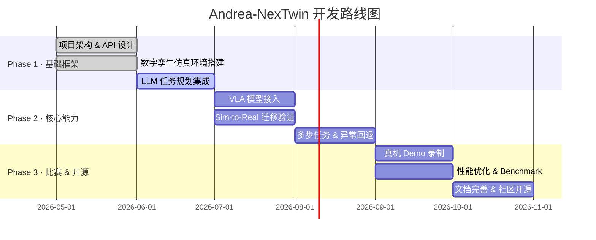

<div align="center">

# 🤖 Andrea-NexTwin

### 下一代具身智能数字孪生平台 · Next-Generation Embodied AI Digital Twin Platform

[](LICENSE)
[](https://python.org)
[](https://docs.ros.org)
[](https://pytorch.org)
[]()

**用自然语言驱动数字孪生仿真，安全迁移至真实机器人执行**

*Drive digital twin simulation with natural language, safely deploy to real robots*

[Demo 视频](#-demo-视频) · [快速开始](#-快速开始) · [架构图](#️-架构图) · [API 示例](#-api-示例) · [Roadmap](#-roadmap)

---

</div>

## 📖 目录

- [项目名称](#-项目名称)
- [一句话介绍](#-一句话介绍)
- [Demo 视频](#-demo-视频)
- [架构图](#️-架构图)
- [快速开始](#-快速开始)
- [技术栈](#-技术栈)
- [文件结构](#-文件结构)
- [API 示例](#-api-示例)
- [Prompt 示例](#-prompt-示例)
- [Roadmap](#-roadmap)
- [Team](#-team)
- [License](#-license)

---

## 📌 项目名称

**Andrea-NexTwin** — 具身智能数字孪生协同执行框架

> Andrea：面向真实场景的人机协作智能体  
> NexTwin：**N**ext-generation **Ex**ecution via Digital **Twin**

---

## 💡 一句话介绍

> **Andrea-NexTwin 让用户用一句自然语言描述任务，系统自动在数字孪生环境中规划、仿真验证并执行，再将验证过的动作安全部署到真实机器人。**

---

## 🎬 Demo 视频

> ⚠️ Demo 视频需展示**真实运行**画面（非 PPT / 概念片），必须包含：用户输入 → 系统响应 → 仿真/真机执行 → 结果反馈。

<!-- 将下方链接替换为你的 Demo 视频 URL（B站 / YouTube / 飞书等） -->
[](https://your-demo-video-url-here)

| 场景 | 用户输入 | 执行结果 |
|------|----------|----------|
| 桌面抓取 | *"把红色方块放到蓝色托盘里"* | ✅ 仿真通过 → 真机执行成功 |
| 导航避障 | *"去厨房，避开地上的障碍物"* | ✅ 路径规划 + 安全到达 |
| 多步任务 | *"先打开抽屉，再把工具放进去"* | ✅ 任务分解 + 顺序执行 |

<details>
<summary>📋 Demo 视频拍摄清单（比赛要求）</summary>

- [ ] 用户输入一句话（屏幕录制可见）
- [ ] 系统实时响应（规划 / 推理过程）
- [ ] 数字孪生仿真画面
- [ ] 真实机器人执行画面（如有硬件）
- [ ] 任务完成结果展示
- [ ] 总时长建议 2–5 分钟

</details>

---

## 🏗️ 架构图



**核心设计原则**

| 原则 | 说明 |
|------|------|
| **Sim-First** | 所有动作先在数字孪生中验证，再部署真机 |
| **Language-Driven** | 自然语言作为统一任务接口 |
| **Closed-Loop** | 感知反馈驱动在线修正与异常回退 |
| **Modular** | 各层解耦，可独立替换模型 / 仿真 / 硬件 |

---

## 🚀 快速开始

### 环境要求

| 组件 | 版本 |
|------|------|
| Python | ≥ 3.10 |
| CUDA | ≥ 11.8（GPU 推理） |
| ROS2 | Humble |
| Docker | ≥ 24.0（推荐） |

### 安装

```bash
# 1. 克隆仓库
git clone https://github.com/MermaidLiu/Andrea-NexTwin.git
cd Andrea-NexTwin

# 2. 创建虚拟环境
python -m venv .venv
source .venv/bin/activate  # Windows: .venv\Scripts\activate

# 3. 安装依赖
pip install -r requirements.txt

# 4. （可选）Docker 一键启动仿真环境
docker compose up -d
```

### 运行 Demo

```bash
# 启动数字孪生仿真 + API 服务
python -m nextwin.server --port 8080

# 另开终端：发送自然语言指令
python -m nextwin.cli "把桌上的杯子移到托盘里"

# 或启动 Web 交互界面
python -m nextwin.webui
# 浏览器访问 http://localhost:7860
```

### 验证安装

```bash
python -m nextwin.health_check
# 期望输出: ✅ All systems ready (LLM · Sim · ROS2)
```

---

## 🛠️ 技术栈

<table>
<tr>
<td align="center" width="120"><br/><b>Python</b><br/>核心逻辑</td>
<td align="center" width="120"><br/><b>PyTorch</b><br/>VLA 模型</td>
<td align="center" width="120"><br/><b>ROS2</b><br/>机器人通信</td>
<td align="center" width="120"><br/><b>LLM</b><br/>任务规划</td>
</tr>
<tr>
<td align="center"><br/><b>Isaac Sim</b><br/>高保真仿真</td>
<td align="center"><br/><b>FastAPI</b><br/>REST API</td>
<td align="center"><br/><b>Gradio</b><br/>Web UI</td>
<td align="center"><br/><b>Docker</b><br/>环境隔离</td>
</tr>
</table>

---

## 📁 文件结构

```
Andrea-NexTwin/
├── README.md                 # 项目说明（本文件）
├── LICENSE                   # MIT 开源协议
├── requirements.txt          # Python 依赖
├── docker-compose.yml        # 仿真环境编排
│
├── nextwin/                  # 核心 Python 包
│   ├── __init__.py
│   ├── server.py             # FastAPI 服务入口
│   ├── cli.py                # 命令行交互
│   ├── webui.py              # Gradio Web 界面
│   │
│   ├── brain/                # 认知规划层
│   │   ├── llm_planner.py    # LLM 任务分解
│   │   ├── vla_model.py      # 视觉-语言-动作模型
│   │   └── action_seq.py     # 动作序列生成
│   │
│   ├── twin/                 # 数字孪生层
│   │   ├── simulator.py      # 仿真引擎封装
│   │   ├── scene_builder.py  # 场景构建
│   │   └── safety_check.py   # 碰撞 / 安全验证
│   │
│   ├── exec/                 # 执行层
│   │   ├── sim2real.py       # Sim-to-Real 迁移
│   │   └── ros_bridge.py     # ROS2 通信桥
│   │
│   └── feedback/             # 感知反馈层
│       ├── vision.py         # 视觉感知
│       └── monitor.py        # 执行监控
│
├── configs/                  # 配置文件
│   ├── robot.yaml            # 机器人参数
│   ├── sim.yaml              # 仿真场景配置
│   └── llm.yaml              # LLM / VLA 模型配置
│
├── assets/                   # 静态资源
│   ├── architecture.png      # 架构图（导出）
│   └── demo/                 # Demo 截图 / GIF
│
├── ros2_ws/                  # ROS2 工作空间
│   └── src/nextwin_bringup/  # Launch 文件 & 驱动
│
├── scripts/                  # 工具脚本
│   ├── setup_env.sh          # 环境初始化
│   └── record_demo.sh        # Demo 录屏辅助
│
└── tests/                    # 单元测试
    ├── test_planner.py
    └── test_simulator.py
```

---

## 🔌 API 示例

### `POST /api/v1/task` — 提交自然语言任务

**Request**

```json
{
  "instruction": "把红色方块放到蓝色托盘里",
  "mode": "sim_first",
  "robot_id": "andrea_arm_01",
  "options": {
    "max_retries": 3,
    "require_sim_verification": true
  }
}
```

**Response**

```json
{
  "task_id": "task_20260709_001",
  "status": "completed",
  "phases": [
    {"phase": "planning",   "status": "done", "duration_ms": 820},
    {"phase": "simulation", "status": "done", "duration_ms": 3400},
    {"phase": "execution",  "status": "done", "duration_ms": 5600}
  ],
  "actions": [
    {"step": 1, "action": "move_to",  "target": "red_cube",   "confidence": 0.96},
    {"step": 2, "action": "grasp",    "target": "red_cube",   "confidence": 0.94},
    {"step": 3, "action": "place",    "target": "blue_tray",  "confidence": 0.97}
  ],
  "result": {
    "success": true,
    "message": "红色方块已成功放置到蓝色托盘"
  }
}
```

### `GET /api/v1/status` — 查询系统状态

```bash
curl http://localhost:8080/api/v1/status
```

```json
{
  "system": "Andrea-NexTwin",
  "version": "0.1.0",
  "components": {
    "llm": {"status": "ready", "model": "gpt-4o"},
    "simulator": {"status": "ready", "engine": "isaac_sim"},
    "robot": {"status": "connected", "id": "andrea_arm_01"}
  }
}
```

### `POST /api/v1/sim/reset` — 重置仿真场景

```bash
curl -X POST http://localhost:8080/api/v1/sim/reset \
  -H "Content-Type: application/json" \
  -d '{"scene": "tabletop_manipulation"}'
```

---

## 💬 Prompt 示例

### 系统 Prompt（任务规划）

```
你是 Andrea-NexTwin 的任务规划器，负责将用户的自然语言指令分解为机器人可执行的动作序列。

## 能力
- 理解桌面操作、导航、抓取-放置等具身任务
- 输出结构化 JSON 动作序列
- 考虑安全约束：碰撞避免、力控限制、工作空间边界

## 输出格式
{
  "task_summary": "一句话任务摘要",
  "steps": [
    {"action": "move_to|grasp|place|navigate|open|close", "target": "物体/位置", "params": {}}
  ],
  "safety_notes": ["注意事项"]
}

## 约束
- 每步动作必须物理可行
- 优先选择安全路径
- 不确定时请求用户澄清
```

### 用户 Prompt 示例

| # | 用户输入 | 预期行为 |
|---|----------|----------|
| 1 | `帮我把桌上的红色杯子放到洗碗机里` | 识别物体 → 规划抓取路径 → 仿真验证 → 执行 |
| 2 | `检查一下房间有没有障碍物，然后走到门口` | 环境感知 → 路径规划 → 导航执行 |
| 3 | `把三个积木按红-绿-蓝顺序叠起来` | 多步任务分解 → 顺序执行 → 状态跟踪 |
| 4 | `太远了，近一点再抓` | 理解反馈 → 调整末端执行器位姿 → 重试 |
| 5 | `停止！` | 紧急中断 → 安全停臂 → 状态保存 |

### VLA 视觉 Prompt

```
<image>当前场景：{scene_description}
任务：{user_instruction}
请输出下一步动作的 7-DoF 末端位姿 [x, y, z, qx, qy, qz, qw] 和夹爪开合度。
```

---

## 🗺️ Roadmap



| 里程碑 | 目标 | 状态 |
|--------|------|------|
| **M1** | 自然语言 → 仿真执行闭环 | 🟡 进行中 |
| **M2** | Sim-to-Real 真机验证 | ⚪ 计划中 |
| **M3** | 多任务泛化 & 比赛 Demo | ⚪ 计划中 |
| **M4** | 开源发布 & 文档完善 | ⚪ 计划中 |

---

## 👥 Team

<table>
<tr>
<td align="center" width="200">
<br/>
<b>@MermaidLiu</b><br/>
<sub>项目负责人 · 架构设计</sub><br/>
<a href="https://github.com/MermaidLiu">GitHub</a>
</td>
<td align="center" width="200">
<br/>
<b>Andrea</b><br/>
<sub>具身智能 · 算法研发</sub><br/>
<sub>（待补充）</sub>
</td>
<td align="center" width="200">
<br/>
<b>团队成员</b><br/>
<sub>仿真 / 硬件 / 前端</sub><br/>
<sub>（待补充）</sub>
</td>
</tr>
</table>

> 💡 **欢迎合作**：如有兴趣加入或交流，请通过 [GitHub Issues](https://github.com/MermaidLiu/Andrea-NexTwin/issues) 联系我们。

---

## 📄 License

本项目采用 [MIT License](LICENSE) 开源协议。

```
MIT License · Copyright (c) 2026 Andrea-NexTwin Team
```

---

<div align="center">

**如果这个项目对你有帮助，请给一个 ⭐ Star！**

Made with ❤️ for Embodied AI

</div>
